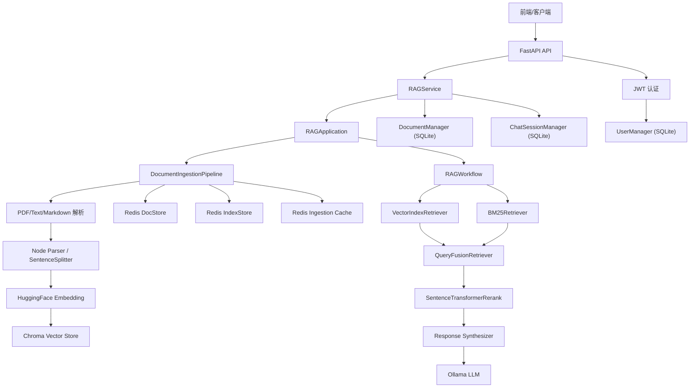

# LlamaIndex RAG 项目说明

## 项目概述

这是一个基于 FastAPI 和 LlamaIndex 构建的本地 RAG 问答服务。项目支持文档上传、文档解析、切分、嵌入、向量化入库、混合检索、重排序、答案生成、流式输出、用户登录认证、文档状态记录以及多会话列表管理。

当前项目更像是一个 RAG 后端服务原型，前端可以通过 API 完成登录、上传知识库文档、查看文档处理状态、发起普通问答或流式问答，并在左侧展示当前用户创建过的会话列表。

## 当前核心能力

- 用户认证：使用 JWT，用户数据保存在 SQLite 中。
- 默认账号：`root`，默认密码：`root`。
- 文档上传：支持多文件上传，并保存到 `file/resources`。
- 文档摄取：对文档进行解析、切分、标题提取、嵌入和向量化。
- 向量数据库：使用本地 Chroma，持久化目录为 `file/chroma_db`。
- 文档/索引存储：使用 Redis 存储 LlamaIndex 的 docstore、index store 和 ingestion cache。
- 文档状态：使用 SQLite 记录文件是否正在处理、是否完成向量化、节点数量、错误信息等。
- 检索流程：向量检索 + BM25 混合检索，再经过 reranker 重排序。
- 回答生成：通过 LlamaIndex response synthesizer 基于检索节点生成回答。
- 流式输出：支持 SSE 流式返回来源和 token 片段。
- 多会话列表：使用 SQLite 记录用户创建的 chat session，标题默认取首次提问前 18 个字符。

## 技术栈

- Web 框架：FastAPI
- RAG 框架：LlamaIndex
- 本地 LLM：Ollama
- 当前模型配置：`deepseek-r1:1.5b`
- 嵌入模型：HuggingFaceEmbedding，本地路径来自 `Settings.EMBEDDING_MODEL_PATH`
- 向量数据库：Chroma
- 关键词检索：BM25Retriever
- 混合检索：QueryFusionRetriever
- 重排序：SentenceTransformerRerank
- 结构化状态库：SQLite
- LlamaIndex 存储层：Redis
- 认证：JWT + pwdlib 密码哈希

## 目录结构

```text
llamaindex_project/
├── app/
│   ├── main.py                 # FastAPI 应用入口
│   ├── schemas.py              # API 请求/响应模型
│   ├── routers/
│   │   ├── chat.py             # 聊天、流式聊天、会话列表接口
│   │   ├── documents.py        # 文档上传、文档列表、重置接口
│   │   └── users.py            # 登录、注册、用户信息接口
│   └── services/
│       └── rag_service.py      # API 层与核心 RAG 应用之间的服务适配
├── config/
│   └── settings.py             # 全局配置
├── core/
│   ├── application.py          # RAG 应用主类
│   ├── ingestion.py            # 文档摄取管道
│   ├── workflow.py             # RAG 工作流
│   ├── events.py               # Workflow 事件定义
│   ├── documentManager.py      # SQLite 文档状态管理
│   ├── chatSessionManager.py   # SQLite 会话列表管理
│   ├── userManager.py          # SQLite 用户管理
│   └── pdf_parser.py           # PDF 解析处理
├── file/
│   ├── app.db                  # SQLite 数据库
│   ├── chroma_db/              # Chroma 向量库持久化目录
│   ├── resources/              # 上传后的原始文档
│   ├── storage_bm25/           # BM25 持久化目录
│   └── image/                  # PDF 图片资源目录
├── requirements.txt
└── README.md
```

## 系统架构



## 数据存储设计

### SQLite

SQLite 路径由 `Settings.SQLITE_DB_PATH` 指定，默认是：

```text
file/app.db
```

当前保存三类业务数据。

### 1. users

由 `core/userManager.py` 管理。

用途：保存真实用户数据，不再使用内存字典。

主要字段：

- `username`
- `hashed_password`
- `email`
- `full_name`
- `disabled`
- `created_at`
- `updated_at`

启动时会确保存在默认用户：

```text
username: root
password: root
```

### 2. documents

由 `core/documentManager.py` 管理。

用途：记录文档处理状态，供 `/api/docs/list` 返回给前端。

主要字段：

- `doc_id`
- `file_name`
- `file_path`
- `file_type`
- `file_size`
- `status`
- `message`
- `node_count`
- `error`
- `created_at`
- `updated_at`

常见状态：

- `processing`
- `completed`
- `failed`

### 3. chat_sessions

由 `core/chatSessionManager.py` 管理。

用途：记录当前用户创建过哪些对话，供左侧会话列表展示。

主要字段：

- `session_id`
- `username`
- `title`
- `first_query`
- `last_message`
- `message_count`
- `created_at`
- `updated_at`

默认标题逻辑：

```text
取用户首次提问的前 18 个字符
```

## Redis 存储

项目使用 Redis 作为 LlamaIndex 的存储层，默认连接：

```text
host: 127.0.0.1
port: 6380
```

当前使用的 namespace / collection：

```text
redis_index
redis_docs
redis_cache
```

用途：

- `RedisIndexStore`：保存 LlamaIndex index struct
- `RedisDocumentStore`：保存文档和切分后的 nodes
- `RedisKVStore`：作为 ingestion cache

## Chroma 向量库

项目当前使用本地 Chroma：

```python
chromadb.PersistentClient(AppSettings.CHROMA_PERSIST_DIR)
```

默认持久化目录：

```text
file/chroma_db
```

默认 collection：

```text
quickstart
```

## 文档摄取流程

文档上传入口：

```text
POST /api/docs/upload
```

处理流程：

1. FastAPI 接收上传文件。
2. 文件保存到 `file/resources`。
3. `RAGService` 将文件标记为 `processing`。
4. `DocumentIngestionPipeline` 读取文件。
5. PDF 走 `MultimodalPDFProcessor` 转成 markdown 文档。
6. 普通文件通过 `SimpleDirectoryReader` 读取。
7. 文档使用稳定逻辑 ID：

```text
knowledge_base/{file_name}
```

8. 文档切分成 nodes。
9. 进行标题提取和 embedding。
10. nodes 写入 Redis docstore。
11. 向量写入 Chroma。
12. 创建或更新 `VectorStoreIndex`。
13. 处理成功后，SQLite 文档状态更新为 `completed`。
14. 如果失败，SQLite 文档状态更新为 `failed`。

## RAG 查询流程

核心工作流在 `core/workflow.py`。

流程：

1. `retrieve_step`
   - 使用向量检索器。
   - 如果 BM25 可用，则通过 `QueryFusionRetriever` 做 Vector + BM25 混合检索。

2. `rerank_step`
   - 使用 `SentenceTransformerRerank` 对召回节点重排序。

3. `generate_step`
   - 使用 `get_response_synthesizer` 创建的 response synthesizer。
   - 调用 `asynthesize(query, nodes)` 基于检索结果生成回答。

4. `finalize_step`
   - 返回回答内容。
   - 返回来源节点的文本、分数和 metadata。
   - 如果是流式模式，则返回 response generator。

当前实现更接近 QueryEngine 风格：每次请求都是独立 query + retrieved nodes + synthesis。虽然系统有 session 列表，但暂时没有把多轮对话消息内容持久化为 ChatEngine 的 memory。

## 聊天与会话

### 非流式聊天

```text
POST /api/chat/chat
```

请求体示例：

```json
{
  "session_id": null,
  "query": "请总结一下知识库内容",
  "knowledge_bool": true,
  "model": "deepseek-r1:1.5b",
  "temperature": 0.1,
  "max_tokens": 100
}
```

说明：

- `session_id` 不传或为 `null` 时，系统会创建一个新会话。
- `session_id` 传已有值时，系统会沿用该会话。
- 返回中会包含实际使用的 `session_id`。

响应示例：

```json
{
  "session_id": "xxxxxxxx-xxxx-xxxx-xxxx-xxxxxxxxxxxx",
  "messages": {
    "role": "assistant",
    "content": "回答内容",
    "sources": []
  }
}
```

### 流式聊天

```text
POST /api/chat/chat/stream
```

返回格式：SSE。

流式响应会先返回一个 session 信息包：

```json
{
  "type": "session",
  "finished": false,
  "content": {
    "session_id": "xxxxxxxx-xxxx-xxxx-xxxx-xxxxxxxxxxxx",
    "title": "请总结一下知识库内容"
  }
}
```

后续会继续返回：

- `sources`
- `text`
- `complete`
- `error`

### 会话列表

```text
GET /api/chat/sessions
```

用于前端左侧展示当前用户创建过的会话。

### 删除会话

```text
DELETE /api/chat/sessions/{session_id}
```

只删除当前用户自己的会话记录。

## 用户认证

登录接口：

```text
POST /users/token
```

表单字段：

```text
username=root
password=root
```

返回 JWT：

```json
{
  "message": "login success",
  "access_token": "...",
  "token_type": "bearer",
  "username": "root"
}
```

后续请求需要携带：

```text
Authorization: Bearer <access_token>
```

常用用户接口：

```text
POST   /users/token
POST   /users/register
POST   /users/logout
GET    /users/me
PUT    /users/me
GET    /users/all
DELETE /users/me
```

## 文档接口

```text
POST /api/docs/upload
GET  /api/docs/list
POST /api/docs/reset
```

### /api/docs/list

该接口现在从 SQLite 的 `documents` 表读取，不再从向量数据库 metadata 反推文档列表。

返回内容包含：

- 文件名
- 文件类型
- 文件大小
- 当前状态
- 节点数量
- 错误信息
- 创建/更新时间

## 运行前依赖

### 1. Redis

需要本地 Redis 服务，当前代码默认使用：

```text
127.0.0.1:6380
```

### 2. Ollama

需要本地 Ollama 服务：

```text
http://localhost:11434
```

并确保模型存在：

```text
deepseek-r1:1.5b
```

### 3. 本地 embedding / rerank 模型

配置位于 `config/settings.py`：

```python
EMBEDDING_MODEL_PATH = r"D:\llm\Local_model\BAAI\bge-large-zh-v1___5"
RERANK_MODEL_PATH = r"D:\llm\Local_model\BAAI\bge-reranker-large"
```

这些路径需要在本机真实存在。

## 启动方式

安装依赖：

```bash
pip install -r requirements.txt
```

启动服务：

```bash
uvicorn app.main:app --host 0.0.0.0 --port 8000 --reload
```

健康检查：

```text
GET /api/health
```

API 文档：

```text
http://localhost:8000/docs
```

## 重要配置

主要配置在 `config/settings.py`。

```python
TEMPERATURE = 0.1
CHUNK_SIZE = 512
CHUNK_OVERLAP = 50
SIMILARITY_TOP_K = 5
RERANK_TOP_K = 3
SIMILARITY_CUTOFF = 0.5
CHROMA_PERSIST_DIR = file/chroma_db
BM25_PERSIST_DIR = file/storage_bm25
RESOURCES_DIR = file/resources
SQLITE_DB_PATH = file/app.db
```

## 当前已知特点和注意事项

1. 当前使用的是 response synthesizer，不是完整 ChatEngine memory 模式。

   多会话列表已经落库，但会话消息内容暂时没有完整持久化。session 目前主要用于前端左侧会话管理和请求隔离。

2. 工作流是固定 RAG 流程。

   当前流程是 retrieve -> rerank -> synthesize。它更像 QueryEngine 形式，而不是带历史记忆的 ChatEngine。

3. Chroma 是本地持久化。

   如果清空或迁移向量库，需要同步考虑 Redis docstore/index store、BM25 目录和 SQLite 文档状态。

4. Redis 中会出现 LlamaIndex 默认 namespace。

   除了项目显式设置的 `redis_index`、`redis_docs`、`redis_cache` 外，LlamaIndex 自身也可能写入默认前缀。

5. Windows 终端可能显示中文乱码。

   项目部分源码注释在 PowerShell 中可能显示为乱码，但不一定代表源文件本身语义错误。

## 后续可优化方向

- 将会话消息完整落库，支持查看某个 session 的历史消息。
- 在工作流中加入历史摘要或最近 N 轮对话，实现更接近 ChatEngine 的体验。
- 增加管理员权限区分，限制文档上传和系统 reset。
- 把 Redis、Ollama、SQLite、Chroma 连接配置统一改成环境变量。
- 增加清理命令，统一清空 Chroma、Redis、BM25 和 SQLite 状态。
- 增加图索引或关系抽取，用于后续关系检索。
- 增加测试用例覆盖文档上传、session 创建、登录认证和 RAG 查询。
